# Architecture

Backend for **BaaS — "Bauer as a Service"**, a university project ("Neue Konzepte").
This document describes what the service does, how it is layered, how a request
flows through it, and where each rule is actually enforced.

- Module: `github.com/Neue-Konzepte-BaaS/backend`
- Language/runtime: Go (see [go.mod](go.mod))
- Database: PostgreSQL + PostGIS
- The React frontend lives in a **separate repository**; the contract between them
  is the HTTP API documented in [openapi.yml](openapi.yml).

---

## 1. Domain in one paragraph

A **farmer** registers, draws one or more **fields** on a map, and subdivides each
field into **plots**. A **customer** searches for free plots near a location —
given either raw coordinates or a German postal code / city name — and **rents**
one for a fixed period (6 months). The system's two interesting invariants are
geometric (a plot must lie inside its parent field — there is no longer any
rectangle requirement) and temporal (a plot cannot be rented twice for
overlapping periods). Both are enforced *in the database*, not in Go — see
[§7](#7-where-the-business-rules-actually-live).

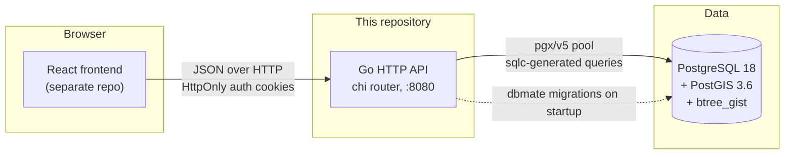

---

## 2. Technology choices

| Concern | Choice | Where |
| --- | --- | --- |
| HTTP router | `go-chi/chi/v5` | [routes.go](internal/handlers/routes.go) |
| CORS | `go-chi/cors` (opt-in via config) | [routes.go:23-31](internal/handlers/routes.go#L23-L31) |
| DB driver / pool | `jackc/pgx/v5` + `pgxpool` | [main.go:60-79](cmd/api/main.go#L60-L79) |
| Query layer | **sqlc** — SQL is hand-written, Go is generated | [sqlc.yml](sqlc.yml), [internal/repositories/db/](internal/repositories/db/) |
| Migrations | **dbmate**, embedded as a library and run at startup | [main.go:23-36](cmd/api/main.go#L23-L36) |
| Geometry types | `twpayne/go-geom` + `twpayne/pgx-geom` | [main.go:67-69](cmd/api/main.go#L67-L69) |
| Password hashing | argon2id (`golang.org/x/crypto/argon2`) | [password.go](internal/credentials/password.go) |
| Tokens | JWT HS256 (`golang-jwt/jwt/v5`) | [token.go](internal/credentials/token.go) |
| Logging | stdlib `log/slog`, JSON handler | [main.go:40-43](cmd/api/main.go#L40-L43) |
| Outgoing mail | stdlib `net/smtp` + `html/template`, templates embedded | [email_sender.go](internal/repositories/email_sender.go), [emailtemplates](internal/emailtemplates/) |
| Integration tests | `testcontainers-go` (real Postgres+PostGIS) | [rental_repository_integration_test.go](internal/repositories/rental_repository_integration_test.go) |

Two deliberate consequences of the sqlc + dbmate pairing:

- **The migrations are the schema of record.** `sqlc.yml` points its `schema:` at
  `sql/migrations/`, so sqlc type-checks queries against the same DDL that runs in
  production. There is no separate `schema.sql` to drift.
- **Generated code is committed.** `internal/repositories/db/*.sql.go` is checked in,
  so a build needs no `sqlc` binary. Regenerate it whenever you touch
  `sql/queries/` or `sql/migrations/`.

---

## 3. Layering

The project follows a strict three-layer architecture, codified in the repo's own
skill file [.claude/skills/three-layer-architecture.md](.claude/skills/three-layer-architecture.md).

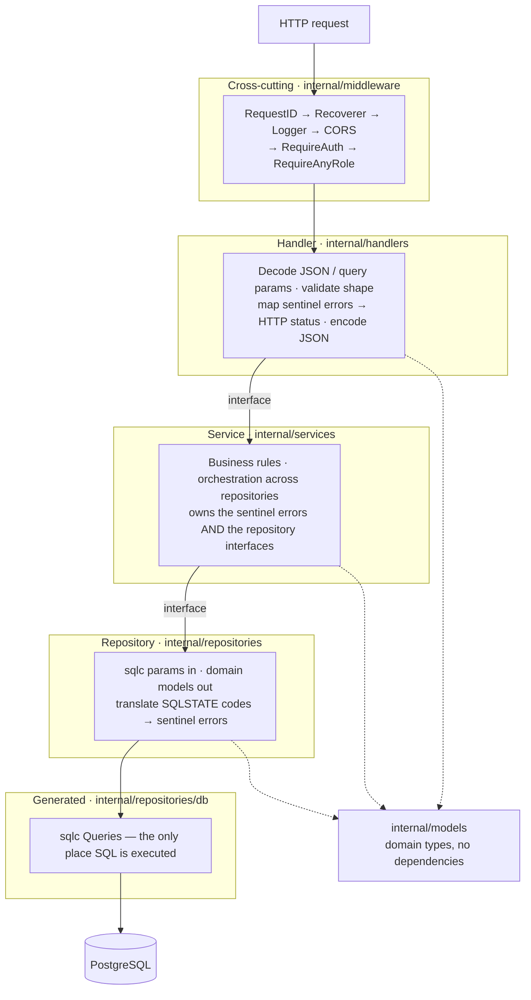

### The inversion that makes it work

Repository **interfaces are declared in the `services` package**
([repositories.go](internal/services/repositories.go)), not in `repositories`.
The service layer owns its data contract; the repository package *implements* it and
its constructors return the service-owned interface type:

```go
// internal/repositories/plot_repository.go
func NewPlotRepository(queries *database.Queries) services.PlotRepository { ... }
```

So the dependency arrow points **upward at compile time** (repositories import
services) while calls flow **downward at runtime**. That is what lets
[auth_service_test.go](internal/services/auth_service_test.go) test the service
against a hand-written fake repository with no database in sight.

### Package map

| Package | Responsibility | Imports |
| --- | --- | --- |
| `cmd/api` | Process entry point: config, migrations, pool, wiring, listen | everything |
| `internal/config` | Env-var loading **and validation** | stdlib only |
| `internal/models` | Domain types (`Account`, `Field`, `Plot`, `Rental`, …) | `uuid`, `go-geom` |
| `internal/credentials` | argon2id hashing; JWT issue/parse | `models` |
| `internal/middleware` | Auth cookie → context claims; role gate | `services`, `credentials`, `webutils` |
| `internal/handlers` | HTTP surface; routing table | `services`, `middleware`, `config`, `webutils` |
| `internal/services` | Business logic + repository interfaces + sentinel errors | `models`, `credentials` |
| `internal/repositories` | sqlc ↔ model mapping; SQLSTATE translation | `services`, `models`, `db` |
| `internal/repositories/db` | **Generated.** Do not edit. | `pgx`, `uuid`, `go-geom` |
| `internal/emailtemplates` | Embedded HTML mail bodies (`embed.FS`) | stdlib |
| `internal/webutils` | `WriteJSON` / `WriteError` | stdlib |

---

## 4. Startup and wiring

All dependency injection is centralised in [cmd/api/main.go](cmd/api/main.go) and
happens strictly bottom-up. Nothing constructs its own dependencies.

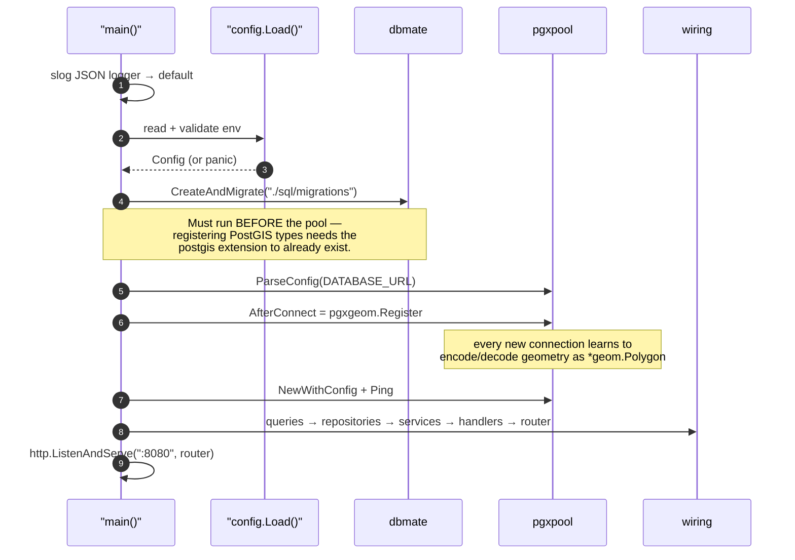

The object graph built in step 6:

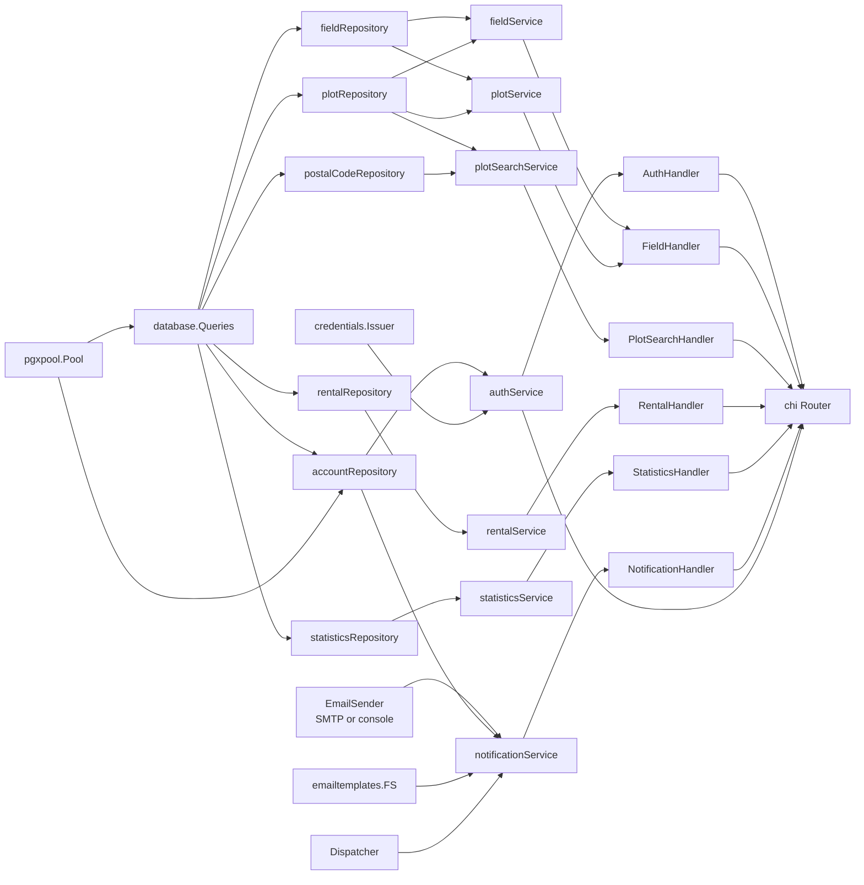

`notificationService` is the one service whose dependencies are not all
database-backed: `EmailSender` is an *outbound port* that happens to live in the
`repositories` package, because the same rule applies to it as to a table —
the interface is declared in `services`, the implementation returns that
interface, and the service cannot tell SMTP from the console logger. Which one
it gets is decided by `newEmailSender` in `main.go` from `SMTP_ENABLED`.

Note `accountRepository` is the only repository that also receives the raw
`*pgxpool.Pool`: it needs `pool.Begin` to insert an account and its role subtype row
in one transaction ([account_repository.go:92-131](internal/repositories/account_repository.go#L92-L131)).
Every other repository is satisfied by `*database.Queries` alone.

---

## 5. HTTP surface

```mermaid
graph TD
    R["chi Router"] --> G["Global: RequestID · Recoverer · Logger<br/>+ CORS when CORS_ENABLED"]

    G --> AD["/api/admin<br/>RequireAuth + RequireRole(admin)"]
    G --> A["/api/auth"]
    G --> FA["/api/farms<br/>— public —"]
    G --> F["/api/fields<br/>RequireAuth + RequireRole(farmer)"]
    G --> P["/api/plots<br/>— public —"]
    G --> RE["/api/rentals<br/>RequireAuth + RequireRole(customer)"]
    G --> N["/api/notifications<br/>RequireAuth + RequireRole(admin)"]
    G --> AN["/api/announcements<br/>RequireAuth + farmer (POST)<br/>farmer or customer (GET)"]
    G --> ST["/api/statistics<br/>RequireAuth + RequireAnyRole(farmer, admin)"]
    G --> CG["/api/care-guide<br/>RequireAuth + RequireRole(customer)"]
    G --> CI["/api/care-instructions<br/>RequireAuth + RequireAnyRole(admin, farmer)"]

    AD --> AD1["GET /farms"]
    AD --> AD2["GET /accounts"]

    FA --> FA1["GET /{farmID}"]

    A --> A1["POST /login"]
    A --> A2["POST /register"]
    A --> A3["POST /logout"]
    A --> A4["GET /me<br/>RequireAuth"]

    F --> F1["POST /"]
    F --> F2["GET /"]
    F --> F3["POST /{fieldID}/plots"]
    F --> F4["POST /{fieldID}/ripeness"]

    P --> P1["GET /nearest"]

    RE --> R1["POST /"]
    RE --> R2["GET /"]

    N --> N1["POST /"]

    AN --> AN1["POST /"]
    AN --> AN2["GET /"]

    ST --> ST1["GET /"]

    CG --> CG1["GET /"]

    CI --> CI1["PUT /{instructionID}"]
    CI --> CI2["DELETE /{instructionID}"]
```

| Method & path | Auth | Role | Handler |
| --- | --- | --- | --- |
| `GET /api/admin/farms` | cookie | admin | [farm_handler.go](internal/handlers/farm_handler.go) |
| `GET /api/admin/accounts` | cookie | admin | [account_handler.go](internal/handlers/account_handler.go) |
| `POST /api/auth/register` | – | – | [auth_handler.go:83](internal/handlers/auth_handler.go#L83) |
| `POST /api/auth/login` | – | – | [auth_handler.go:48](internal/handlers/auth_handler.go#L48) |
| `POST /api/auth/logout` | – | – | [auth_handler.go:137](internal/handlers/auth_handler.go#L137) |
| `GET /api/auth/me` | cookie | any | [auth_handler.go:125](internal/handlers/auth_handler.go#L125) |
| `GET /api/farms/{farmID}` | – | – | [farm_handler.go](internal/handlers/farm_handler.go) |
| `POST /api/fields` | cookie | farmer | [field_handler.go:85](internal/handlers/field_handler.go#L85) |
| `GET /api/fields` | cookie | farmer | [field_handler.go:128](internal/handlers/field_handler.go#L128) |
| `POST /api/fields/{fieldID}/plots` | cookie | farmer | [field_handler.go:163](internal/handlers/field_handler.go#L163) |
| `POST /api/fields/{fieldID}/ripeness` | cookie | farmer | [ripeness_notice_handler.go](internal/handlers/ripeness_notice_handler.go) |
| `GET /api/plots/nearest` | – | – | [plot_search_handler.go:40](internal/handlers/plot_search_handler.go#L40) |
| `POST /api/rentals` | cookie | customer | [rental_handler.go:43](internal/handlers/rental_handler.go#L43) |
| `GET /api/rentals` | cookie | customer | [rental_handler.go:78](internal/handlers/rental_handler.go#L78) |
| `POST /api/notifications` | cookie | admin | [notification_handler.go](internal/handlers/notification_handler.go) |
| `POST /api/announcements` | cookie | farmer | [announcement_handler.go](internal/handlers/announcement_handler.go) |
| `GET /api/announcements` | cookie | farmer or customer | [announcement_handler.go](internal/handlers/announcement_handler.go) |
| `GET /api/statistics` | cookie | farmer or admin | [statistics_handler.go:62](internal/handlers/statistics_handler.go#L62) |
| `GET /api/crops/{cropID}/care-instructions` | cookie | admin or farmer | [care_guide_handler.go](internal/handlers/care_guide_handler.go) |
| `POST /api/crops/{cropID}/care-instructions` | cookie | admin or farmer | [care_guide_handler.go](internal/handlers/care_guide_handler.go) |
| `DELETE /api/crops/{cropID}/farm-care-guide` | cookie | farmer | [care_guide_handler.go](internal/handlers/care_guide_handler.go) |
| `PUT /api/care-instructions/{instructionID}` | cookie | admin or farmer | [care_guide_handler.go](internal/handlers/care_guide_handler.go) |
| `DELETE /api/care-instructions/{instructionID}` | cookie | admin or farmer | [care_guide_handler.go](internal/handlers/care_guide_handler.go) |
| `GET /api/care-guide` | cookie | customer | [care_guide_handler.go](internal/handlers/care_guide_handler.go) |

Geometry crosses the wire as **GeoJSON Polygon** in a `coordinates` field, decoded
and encoded by `decodePolygon` / `encodePolygon`
([field_handler.go:60-81](internal/handlers/field_handler.go#L60-L81)). Every error
response is uniformly `{"error": "..."}` via `webutils.WriteError`.

---

## 6. Authentication and authorization

### Primitives

- **Passwords**: argon2id at the OWASP baseline (19 MiB, t=2, p=1), stored as a
  single PHC string `$argon2id$v=19$m=19456,t=2,p=1$<salt>$<hash>`. The salt lives
  *inside* that string — which is why migration `20260911090000` drops the
  original separate `salt` column. Verification decodes the parameters back out of
  the stored hash and compares with `subtle.ConstantTimeCompare`.
- **Tokens**: HS256 JWTs carrying `user_id`, `role` and a `typ` claim.
  `Issuer.Parse` pins the algorithm (`jwt.WithValidMethods`) *and* checks `typ`, so
  a refresh token can never be presented as an access token. Every rejection
  collapses to one opaque `ErrInvalidToken` so clients learn nothing about *why*.
- **Role in the token**: authorization needs no database round trip — `RequireRole`
  reads the claim.

### Login flow

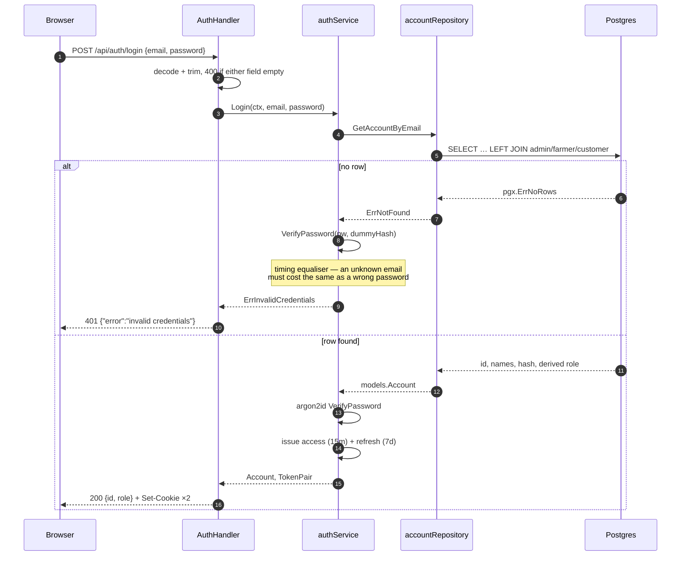

Cookies are `HttpOnly`, with `Secure` and `SameSite` driven by config:

| Cookie | Path | TTL | Notes |
| --- | --- | --- | --- |
| `access_token` | `/` | 15 min | sent with every API call |
| `refresh_token` | `/api/auth/refresh` | 7 days | scoped so it is *not* sent to normal endpoints |

`Path=/api/auth/refresh` is a deliberate blast-radius limiter — but **that endpoint
does not exist yet**, so today a session simply ends after 15 minutes.

### Request-time gating

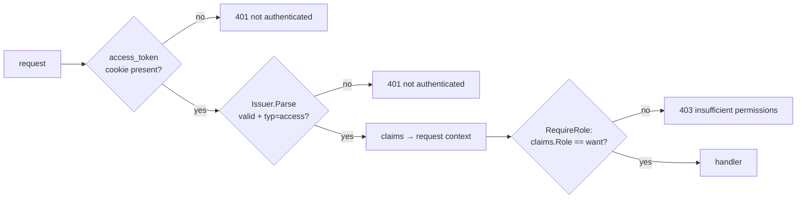

`MustClaimsFromContext` **panics** when claims are missing. That is intentional: a
handler reached without `RequireAuth` in front of it is a routing bug, and it should
surface as a 500 (caught by chi's `Recoverer`) rather than as a misleading 401.

---

## 7. Where the business rules actually live

This is the most distinctive thing about this backend: the two hard invariants are
**database constraints**, and the Go layer's job is to *translate their failures*.

### Data model

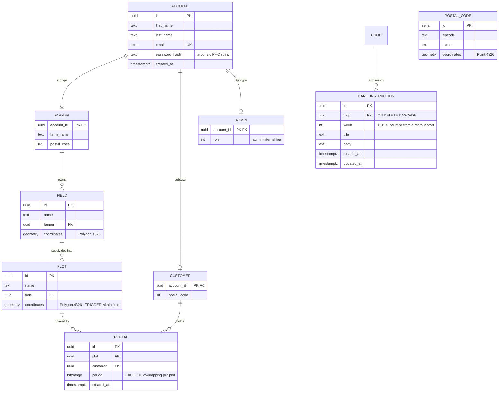

**Role is not a column.** There is no `account.role`; the role is *derived* from
which subtype table an account joins to, via a `CASE` in
[account.sql](sql/queries/account.sql#L22-L27) with precedence
admin → farmer → customer. Consequences:

- Creating an account and its subtype row must be atomic, or an account could exist
  with role `''`. Hence the transaction in `createAccountWithSubtype`.
- Admins cannot self-register: `Register` accepts only `farmer`/`customer` and
  rejects everything else with `ErrInvalidRegistration`. Admins are seeded directly
  in the database.
- `admin.role INT` is an *admin-internal tier*, unrelated to `models.Role`.

### Geometry rules (PostGIS)

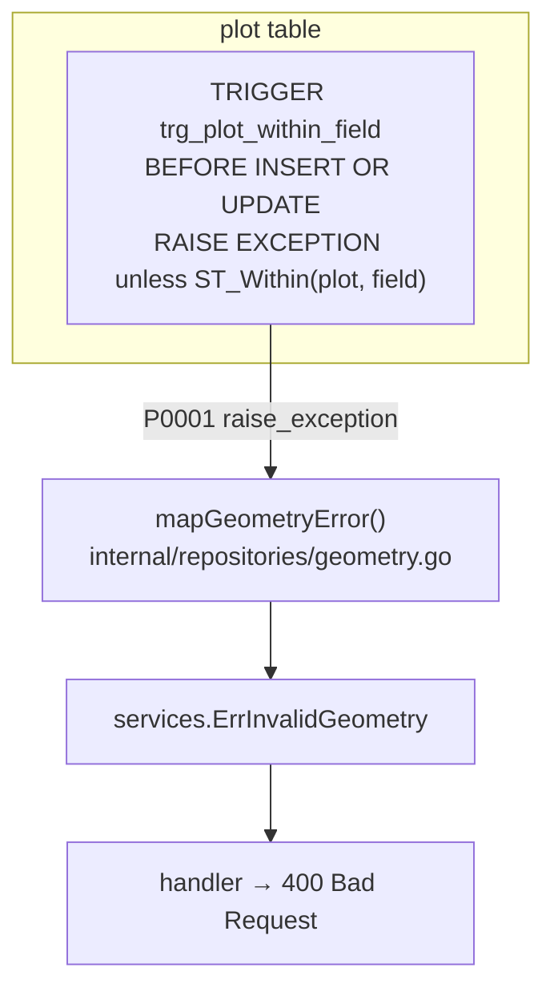

Both tables originally also carried a `CHECK (ST_Equals(coordinates, ST_Envelope(coordinates)))`
— a compact way of saying *"this polygon is its own bounding box"*, i.e. an axis-aligned
rectangle. Migration `20260913155400_drop_field_rectangle_check.sql` dropped it: the
check compared raw lon/lat degrees, but the frontend's drawing tool builds rotatable
rectangles in Web Mercator (screen) space, so a genuine on-screen rectangle could measure
far from square once converted to degrees. `mapGeometryError` (and the `23514
check_violation` SQLSTATE it handles) is kept only for the within-field trigger's
`P0001`, not because a check constraint still exists — fields and plots are no longer
constrained to rectangles at all. Everything is stored in **SRID 4326** (WGS84 lon/lat).

The plot-within-field check is a trigger rather than a `CHECK` constraint because it
must read another table, which `CHECK` cannot do.

### Rental concurrency

```sql
CONSTRAINT rental_no_overlap
    EXCLUDE USING gist (plot WITH =, period WITH &&)
```

This is the critical design decision in the rental feature. `rentalService.RentPlot`
performs **no availability check at all** — it simply inserts and lets Postgres
arbitrate. Two concurrent bookings of the same plot cannot both succeed, which a
read-then-write check in Go could never guarantee without extra locking. The
`btree_gist` extension exists solely so the GiST index can mix equality on a plain
`uuid` column with range overlap on `tstzrange`.

The period is half-open `[start, end)`, so a rental ending exactly when the next
begins is *not* a conflict. `start` comes from the database's `CURRENT_TIMESTAMP`,
never from the caller — [rental.sql](sql/queries/rental.sql#L4-L7) explains why: the
availability filter also compares against `CURRENT_TIMESTAMP`, so a start time from a
host with a fast clock would leave the plot looking free for the difference.

### Rent-a-plot flow

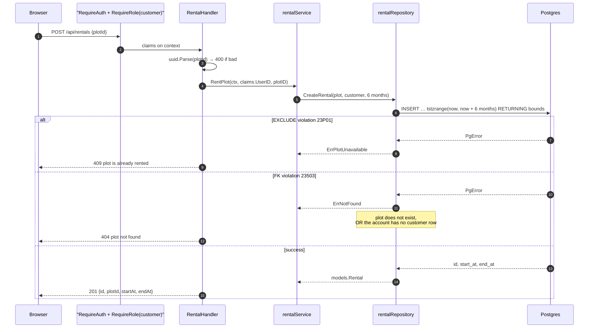

`RentalDurationMonths = 6` is a Go constant, but the schema stores a *range*, so
making the duration caller-supplied later needs no migration.

### Error translation table

The full path from a Postgres error code to an HTTP status:

| SQLSTATE | Raised by | Mapped in | Sentinel | HTTP |
| --- | --- | --- | --- | --- |
| `23505` unique_violation | `account.email` | [account_repository.go:133](internal/repositories/account_repository.go#L133) | `ErrEmailTaken` | 409 |
| `23514` check_violation | nothing today — no CHECK constraint remains (see §7); branch kept defensively | [geometry.go:30](internal/repositories/geometry.go#L30) | `ErrInvalidGeometry` | 400 |
| `P0001` raise_exception | within-field trigger | [geometry.go:30](internal/repositories/geometry.go#L30) | `ErrInvalidGeometry` | 400 |
| `23P01` exclusion_violation | `rental_no_overlap` | [rental_repository.go:72](internal/repositories/rental_repository.go#L72) | `ErrPlotUnavailable` | 409 |
| `23503` foreign_key_violation | rental FKs | [rental_repository.go:72](internal/repositories/rental_repository.go#L72) | `ErrNotFound` | 404 |
| `pgx.ErrNoRows` | any `:one` query | each repository | `ErrNotFound` | 404 / 401 |

Ownership checks stay in Go, because they are authorization rather than data
integrity: `plotService.CreatePlot` loads the field's owner first and returns
`ErrForbidden` (→ 403) if it is not the calling farmer
([field_service.go:94-105](internal/services/field_service.go#L94-L105)).

---

## 8. Spatial search

`GET /api/plots/nearest` is the only public read endpoint and the only one with two
input modes:

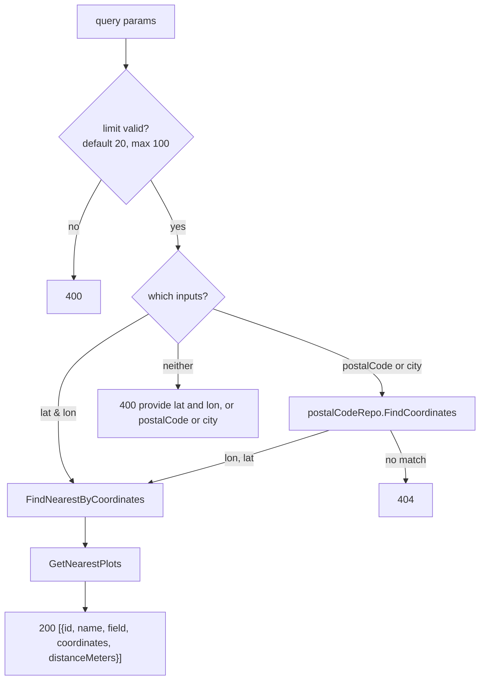

The query behind it ([plot.sql](sql/queries/plot.sql#L16-L34)) does three things at
once:

1. **Filters out currently-rented plots** with `NOT EXISTS (… r.period @> CURRENT_TIMESTAMP)`.
   Because it tests containment of *now* rather than the existence of any rental, an
   expired rental automatically stops hiding its plot — no cleanup job needed.
2. **Orders** by the PostGIS KNN operator `coordinates <-> point`, which the
   GiST index `idx_plot_coordinates` can serve as an index scan.
3. **Reports** `distance_meters` by casting the plot centroid and the search point to
   `geography`, giving true metres on the spheroid.

Note that (2) and (3) use different metrics: ordering is planar degrees, the reported
distance is geodesic metres. Across Germany the ranking difference is negligible, but
it is a real inconsistency if the data ever spans wider latitudes.

Postal codes are seeded by migration `20260913114701_postal_codes.sql`, a ~1.5 MB file
of German `zipcode → (name, point)` rows. City lookup is a
`ILIKE '%' || city || '%' … LIMIT 1` — deliberately forgiving, but it means an
ambiguous city name silently resolves to whichever row sorts first by name.

---

## 9. Statistics

`GET /api/statistics` is the first route more than one role can reach — the caller's
**role** picks the scope, never a request parameter:

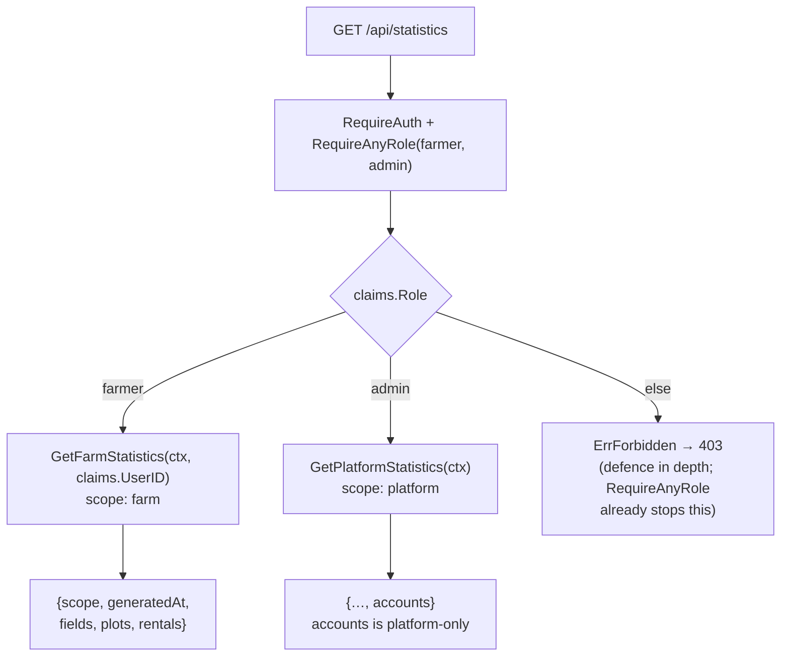

There is deliberately no `?scope=` parameter and no farmer id anywhere in the request:
the farmer's own id comes from the signed JWT (`claims.UserID`), so there is nothing for
a farmer to tamper with to see another farmer's — let alone the platform's — numbers.

Each scope is **one** `:one` aggregate query
([statistics.sql](sql/queries/statistics.sql)), built as a cross-join of single-row
CTEs, one per statistic group. One round trip means one MVCC snapshot, so e.g.
`plots.rented` and `rentals.active` can never disagree within the same response.
`occupancyRate` and `available` are derived in Go (`withDerivedStatistics`,
[statistics_service.go](internal/services/statistics_service.go)) rather than SQL, so a
farmer with no plots yet is an ordinary guarded branch rather than a division by zero
crossing into pgx.

Extending it later costs exactly: one CTE, one line in the final `SELECT`, one field on
`models.Statistics`, one field on the handler's response struct, one OpenAPI property.
Nothing else in the request path changes. `field` and `plot` have no `created_at`, which
is why only `account`- and `rental`-derived figures have a `last30Days` window — adding
one for fields or plots needs that column first.

`RequireAnyRole(roles ...models.Role)` in
[role.go](internal/middleware/role.go) is the mechanism that let a second role onto one
route; `RequireRole` is now its single-role case, so every existing call site is
unaffected. See also §13, gap 3.

---

## 9a. Notifications

The provider is one interface with one implementation today, arranged so a
second channel costs nothing at the call sites:

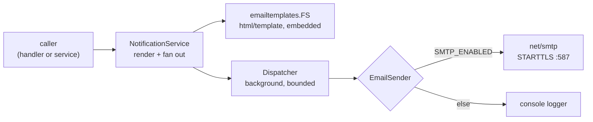

Three decisions worth knowing before extending it:

- **Templates are embedded, not read from disk.** The runtime image copies only
  the binary and `sql/migrations/`, so a `templates/` directory would exist in
  development and be missing in production — a failure that only shows up when
  the first mail is sent. `embed.FS` makes that unrepresentable, and lets tests
  pass an `fstest.MapFS` instead.
- **Delivery happens after the response.** `net/smtp` opens a fresh connection
  per message, so a broadcast to every account would otherwise hold the request
  open for as long as it takes to reach everyone. The endpoint therefore answers
  **202** with the number of recipients *queued*. The cost is that delivery is
  best-effort: nothing is retried, and a rejected address is logged, not
  reported. An outbox table with a worker is the upgrade path if that stops
  being acceptable.
- **Shutdown is graceful because of the above.** `main.go` drains the HTTP
  server and then waits on the `Dispatcher`, both under one deadline. The
  deadline is not optional: `smtp.SendMail` takes no context and has no timeout
  of its own, so a hung relay would otherwise keep the process alive forever.
  It is also a limit, not a fix: a fan-out that has not finished when the
  deadline passes is abandoned, and since each message costs a fresh connection,
  only a small audience is reached within it. Queued mail is therefore still
  lost on a deploy mid-broadcast — less of it than before, but the guarantee is
  narrower than "graceful shutdown" suggests. The outbox table above is what
  actually closes it.

Recipients are resolved *before* the handler returns, so a database failure is a
500 rather than a silently empty send. Admins are excluded from a platform
broadcast, and so is any account with no farmer or customer row — the query
tests membership positively rather than filtering admins out.

### The Schwarzes Brett

A farmer's announcement is the second fan-out, and the one that shows why the
provider is an interface rather than a function: `announcementService` stores
the notice and then calls `NotifyFarmerCustomers`, reusing the dispatcher, the
bounded concurrency and the shutdown drain unchanged. Only the audience query
and the template differ.

Two things are worth knowing before extending it:

- **"His customers" means the customers currently renting one of his plots** —
  `r.period @> CURRENT_TIMESTAMP`, the same predicate §9's statistics use. A
  rental that has ended ends the farmer's reach: there is no other
  relationship between a farmer and a customer in this schema, so the rental is
  also the licence to mail. The audience query joins `account` through
  `rental`, `plot` and `field`, so it **must** be `DISTINCT` — a customer
  renting three plots from one farmer is one person, and the integration test
  in `announcement_repository_integration_test.go` exists to hold that.
- **The notice is stored before it is mailed, and survives a delivery
  failure.** This is the board earning its keep: best-effort delivery (above)
  means a mail can be lost, and the board is where the customer reads it
  anyway. A failed send therefore logs and returns `recipients: 0` rather than
  failing the request — the announcement was still posted. The cost is that
  `recipients: 0` is ambiguous, meaning either "no current renters" or "nothing
  could be queued"; distinguishing them needs a response field this API does
  not have yet.
- **The board is not a record of what was mailed, in either direction.** The
  audience query and the customer's board share the rental predicate, but the
  rental gates *which farmers* a customer reads, not *which notices*: a
  customer who starts renting today reads everything that farmer posted before
  he arrived, and when his rental ends the whole board goes with it, including
  notices he was mailed at the time. That is the board behaving like a board
  rather than an inbox, and it is a deliberate choice — but it means a notice
  written for one set of renters stays readable by the next, so anything a
  farmer would not repeat to a stranger does not belong on it. Tying visibility
  to the rental the notice was posted during (`r.period @> a.created_at`) is
  the one-line change that would make the board an inbox instead.

`announcementService` is the first service to depend on another service rather
than only on repositories. Storing-then-notifying is one business rule, and
splitting it across the handler would put ordering logic in the layer that is
not allowed to hold any; `NotificationService` is an interface owned by
`services`, so the dependency is still inverted.

### Scoping the board to a field or plot

`announcement` carries two optional columns, `field` and `plot`, constrained
so at most one is set (`announcement_scope_not_both`). `NULL`/`NULL` is the
original behaviour — every current renter. Setting one narrows both sides of
the feature to the same scope:

- **The audience** switches from `GetCustomersOfFarmer` to
  `GetCustomersOfFarmerForField`/`GetCustomersOfFarmerForPlot` — the same
  `DISTINCT`-over-`rental` shape, just with the join's `WHERE` swapped from
  "this farmer's plots" to "this field's plots" or "this plot".
- **The board read** (`GetAnnouncementsForCustomer`) ties the scope to the
  *specific* rental that qualifies the customer, not to the farmer's holdings
  at large: the query already joins `field`/`plot` through the matching
  rental, so `a.field = fi.id OR a.plot = p.id` (or neither set) reuses those
  same joined rows rather than adding a second lookup.

A scoped notice is otherwise an ordinary announcement — same table, same
`NotifyFarmerCustomers` fan-out, same template — so nothing downstream needed
to learn a new concept.

### Ripeness notices

A third fan-out, `ripeness_notice`, follows the announcement shape closely
enough to share its infrastructure (`Dispatcher`, `deliverInBackground`) but
differs in what "the board" means:

- **The audience is field *and* crop, not just field.** A field can grow
  several crops across its plots, and a ripeness notice is only relevant to
  the renters growing the one that is ready:
  `GetCustomersOfFarmerForFieldAndCrop` joins on `rental.crop = crop`
  alongside `plot.field = field`. The read side
  (`GetRipenessNoticesForCustomer`) mirrors this with the same join, so a
  customer only ever sees a notice for a crop his own active rental matches.
- **It is not a board.** Unlike announcements, a ripeness notice has no
  `GET /api/ripeness` of its own — it is mail plus one `InboxItem` kind
  (`ripeness_notice`) in the merged `GET /api/inbox` feed
  (`InboxService.GetInboxForCustomer`). The subject/body shown there are
  synthesized in the service (`"<crop> ist reif"` / `"<crop> auf <field> ist
  bereit zur Ernte."`) rather than stored, since the notice itself only
  stores the ids and names, not free text — there is nothing for a farmer to
  write.
- **Ownership is checked the same way `plotService.CreatePlot` checks a
  field:** resolve the caller's farm, resolve the target field's farm,
  compare, `ErrForbidden` on mismatch. `RipenessNoticeService` is the third
  service (after `announcementService`) to depend on `NotificationService`
  directly.

---

## 9b. Admin listings

`GET /api/admin/farms` and `GET /api/admin/accounts` ([§5](#5-http-surface)) are the
same design applied to lists. The caller's role is the whole of the scope — both are
admin-only and always platform-wide, and there is deliberately **no farm-id or
farmer-id filter** on the farm list, so there is no identity parameter to tamper with
should a second role ever reach these routes.

`GET /api/admin/farms` and the public `GET /api/farms/{farmID}` are two views of the
same `farm` row, split by audience rather than by entity: the public one carries the
description and founding date a visitor reads, the admin one the owner and the holdings
an operator scans. Both key on the same farm id, and both live on `FarmService` — which
is why the farm listing is a domain service rather than an "AdminService": the audience
is a routing concern, not a domain one.

The farm list computes its per-farm figures with the predicates
[statistics.sql](sql/queries/statistics.sql) uses, unchanged: `ST_Area` over
`::geography` for areas, and `period @> CURRENT_TIMESTAMP` for "rented right now". That
buys a testable invariant:

> Summing `fields.total`, `plots.total` and `plots.rented` across every page of
> `GET /api/admin/farms` reproduces `fields.total`, `plots.total` and `plots.rented`
> from `GET /api/statistics` at platform scope, exactly.

An admin who compares the two screens must not see two different numbers, so
`TestListFarms_ReconcilesWithPlatformStatistics` asserts it. `available` and
`occupancyRate` go further and share the code: `derivePlotFigures`
([statistics_service.go](internal/services/statistics_service.go)) is what both
`withDerivedStatistics` and `farmService.ListFarms` call, so "occupancy" cannot come to
mean two things.

Aggregating per farm needs one thing §9's cross-join of single-row CTEs does not: each
figure hangs off its own `LEFT JOIN LATERAL`. Grouping a farm's fields, plots and
rentals in a single joined pass would multiply the rows against one another and count
each field once per plot. An ungrouped aggregate returns a row even over no rows, so a
farm that owns nothing is a row of zeros rather than a missing row — the same promise
§9 makes to a farmer who owns nothing.

**Pagination** arrives with these two routes and only these two (§13, gap 9). `limit`
(default 20, max 100) and `offset`, with `total` taken in the same query as the rows via
`(COUNT(*) OVER ())`. That is the §9 single-round-trip rule doing a second job: a
registration landing between two round trips cannot make page 2 skip a row. The response
is an envelope, `{items, total, limit, offset}` — unlike the bare arrays returned by
`GET /api/fields`, `/api/rentals` and `/api/announcements`, because a bare array has
nowhere to put `total`. New paginated routes should use the envelope; the existing three
were left alone. Ordering always ends in a tiebreaker on `id`: farm names and
`created_at` are both non-unique, and without it a row can shift between pages and never
be shown.

---

## 9c. The weekly care guide

Issue #44. A **care instruction** is one task attached to a crop and a week:
"week 3 — thin out the seedlings". A tenant reads those tasks against their own
rental, so `GET /api/care-guide` answers with one entry per plot the caller is
renting *right now*, each carrying the crop's guide plus `currentWeek` of
`totalWeeks`.

Three decisions shape it, and each rules out an alternative that looks cheaper
at first:

**A week is a rental week, not a calendar week.** Rentals start whenever a
customer books. Pinning the guide to ISO weeks would put two tenants growing
the same crop at the same task on the same date although one of them sowed two
months later. Week 1 is a rental's first seven days:

```
current_week = floor((now - lower(period)) / 7 days) + 1
total_weeks  = ceil((upper(period) - lower(period)) / 7 days)
```

Both are computed **in the query**, against the database clock, for the same
reason `InsertRentalRequest` takes its bounds from it ([§7](#rental-concurrency)):
an API host whose clock runs ahead would otherwise put a tenant a week further
into their season than the rental they were sold. `WHERE period @> CURRENT_TIMESTAMP`
is what makes `current_week` safe to count from 1 — an elapsed time cannot be
negative for a period that contains now.

**Approval, not just the period, is the audience rule.** Since rental requests
a `rental` row exists from the moment a customer *asks* for a plot, and a
declined request keeps its row (the exclusion constraint stops counting it, but
nothing deletes it). Filtering on the period alone would therefore hand the
guide to someone still waiting for an answer, or turned down — so the query
also requires `status = 'approved'`, exactly as `GetAnnouncementsForCustomer`
does for the board. It is worth knowing that
`GetRipenessNoticesForCustomer` does **not** filter on status today; if that is
intentional, the two audiences disagree, and if it is not, it is the same bug
this line exists to avoid.

**Every farm starts from one default guide, and may make it its own.**
(Issue #68.) An admin maintains a default guide per crop, so a farmer offering
tomatoes does not have to write tomato advice from scratch. A farmer who wants
to say it differently takes the crop's guide over for their own farm; from then
on that farm's tenants read the farm's version, and every other farm still
reads the default. `care_instruction.farm` is `NULL` for the default and the
farm's id for its own version. The alternatives both lose something: one shared
guide farmers may edit lets two farms overwrite each other's advice, and
guides that start empty make every farmer rewrite the same basics.

The mechanics are **copy-on-write per crop**:

- A `farm_care_guide (farm, crop)` row marks the takeover. While it exists,
  the farm reads only its own steps for that crop, never a mix, and the query
  (`GetEffectiveCareInstructions`) resolves "farm's own, else default" per
  `(crop, farm)` pair in one round trip. The marker is kept separate from the
  steps so a farm's guide can be *empty*: a farmer who deletes every step has
  an empty guide, not the default back.
- A farmer's first write for a crop (create, edit or delete) inserts the
  marker and copies the default guide in one transaction
  (`StartFarmCareGuide`). The marker's primary key makes two first writes at
  once safe: the second one inserts nothing, so it copies nothing.
- A farmer edits a default step through the id they were shown. Each copy
  records the default it came from in `based_on`, so the service finds the
  farm's copy and changes that; the default itself is never touched.
- Resetting (`DELETE /api/crops/{cropID}/farm-care-guide`) deletes the
  marker, and the composite foreign key `(farm, crop) → farm_care_guide`
  cascades to the farm's steps.
- An admin writes the default guide, and may also edit or delete a farm's step
  by id, as moderation. A farmer who reaches another farm's step gets `404`,
  the same answer as for an id that does not exist.

The cost of copying: once a farm has its own guide, later changes to the
default no longer reach it. The farmer can reset to pick them up. Overriding
single steps instead would let default changes keep flowing, but at the price
of a model for hiding default steps and mixing in the farm's own.

What *is* about the farm's day-to-day, like "the water is off on Tuesday", is
still an announcement ([§9a](#the-schwarzes-brett)), not a care step.
`GET /api/crops/{cropID}/care-instructions` returns the default to an admin and
the farm's effective guide to a farmer, with an `X-Care-Guide-Source: farm |
default` header saying which it is. The header is there because an empty farm
guide and an empty default look the same as bodies.

**The service trims the guide to the rental.** A guide is written once per
crop, but rental length comes from that crop's `duration_months`, so a guide
running to week 30 against a 13-week rental would promise tasks for weeks the
tenant never reaches. `instructionsWithinRental`
([care_guide_service.go](internal/services/care_guide_service.go)) drops them.
It is the service's job rather than the query's: the cutoff is a fact about one
rental, while the query is written for all of the caller's at once.

Two round trips, not one per plot: the active rentals (each carrying its
plot's farm), then every `(crop, farm)` guide in a single read over two zipped
arrays, grouped by pair in the repository. A customer renting four plots of the
same crop on one farm reads that guide once — the same deduplication reflex as
`GetCustomersOfFarmer` in §9a, for the same reason.

`care_instruction.crop` cascades on delete, where `rental.crop` does not. That
asymmetry is deliberate: a rental is a commitment that must keep a crop in the
catalog (hence `DeleteCrop`'s 409), while advice about a crop nobody offers any
more has nothing left to be about, and must not be the thing that blocks an
admin from tidying the catalog.

**In the inbox.** `GET /api/inbox` (§9a) shows the guide as `care` items,
derived at read time from `GetCareGuideForCustomer` rather than stored: one
item per instruction whose week of the rental has begun, dated at the start of
that week. Reusing the care guide keeps its two rules — approved rentals
covering today, weeks the rental never reaches dropped — in one place. An
instruction belongs to the crop, so two plots of the same crop would share its
id; the item's id is instead a name-based UUID of rental and instruction,
stable across reads and distinct per plot.

**What it does not do yet.** Nothing mails a care instruction — the inbox item
appears when its week begins, but no weekly digest is pushed the way an
announcement is. Adding one means scheduling a fan-out at each tenant's own
week boundary, a question this feature deliberately leaves open.

---

## 10. Configuration

Everything comes from environment variables; `config.Load()` validates and returns
a joined error rather than failing on the first problem.

| Variable | Default | Validation | Purpose |
| --- | --- | --- | --- |
| `DATABASE_URL` | – | required, must have a scheme | Postgres DSN, also used by dbmate |
| `JWT_SECRET` | – | **≥ 32 chars** | HS256 signing key |
| `CORS_ENABLED` | `false` | bool | mounts the CORS middleware |
| `FRONTEND_URL` | – | required & absolute when CORS on | the single allowed origin |
| `COOKIE_SECURE` | **`true`** | bool | `Secure` flag on auth cookies |
| `SAME_SITE_STRICT` | **`true`** | bool | `Strict` vs `Lax` |
| `DB_AUTO_MIGRATE` | `false` | bool | parsed but **currently unused** (see §13) |
| `SMTP_ENABLED` | `false` | bool | off wires the console sender instead of SMTP |
| `SMTP_HOST` | – | required when enabled | mail relay |
| `SMTP_PORT` | **`587`** | 1–65535, checked always | STARTTLS; 465 implicit TLS is unsupported |
| `SMTP_USERNAME` / `SMTP_PASSWORD` | – | – | empty username ⇒ no AUTH |
| `SMTP_SENDER_NAME` | – | required when enabled | `From` display name |
| `SMTP_SENDER_EMAIL` | – | required when enabled, must parse | envelope sender |

The two security-relevant flags default to the *safe* value, so a production deploy
that forgets them fails closed; local HTTP development against the Vite dev server is
the case that must opt out (`COOKIE_SECURE=false`, `SAME_SITE_STRICT=false`, since
`Strict` blocks the cookie on a cross-site XHR from `:5173`).

---

## 11. Testing strategy

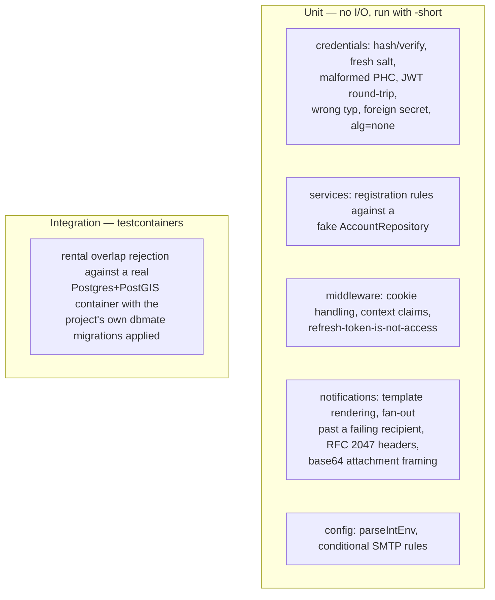

The integration test is worth reading as documentation: `setupTestDB` wires the pool
*exactly* as `main.go` does, including `pgxgeom.Register`, then seeds a farmer → field →
plot chain and asserts that a second overlapping booking comes back as
`ErrPlotUnavailable`. It verifies the constraint *and* the SQLSTATE mapping in one shot.

CI ([.github/workflows/ci.yml](.github/workflows/ci.yml)) runs four parallel jobs:
build, lint (`gofmt` must print nothing + `golangci-lint`), unit tests
(`go vet` + `go test -short -race`), and integration tests (`go test -tags=integration -race`).

---

## 12. Deployment

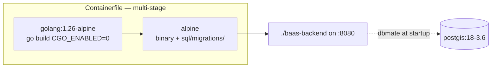

`sql/migrations/` is copied into the runtime image because migrations are read from
disk at startup — the binary alone is not enough. [compose.yml](compose.yml) provides
the PostGIS database for local development (the backend service in it is commented
out; the usual loop is `docker compose up -d db` + `go run ./cmd/api`).
[Makefile](Makefile) adds convenience targets for the `dbmate` CLI.

---

## 13. Known gaps and rough edges

Observations from reading the code as it stands — none of these are blocking, but
they are the things a newcomer will trip over:

1. **`DB_AUTO_MIGRATE` is dead config.** It is parsed and validated but never read;
   `main.go` calls `migrateDB` unconditionally. Either gate the call on it or drop
   the flag.
2. **No `/api/auth/refresh`.** The refresh token is issued and path-scoped to an
   endpoint that does not exist, so sessions hard-expire after the 15-minute access
   TTL. This is the most user-visible missing piece.
3. ~~**Admins are unreachable through the API.**~~ Closed: `RequireAnyRole` (§9) exists,
   and `/api/admin` (§9b) is now an admin-only route group of its own, with the farm and
   account listings under it. Admins still cannot self-register — by design, they are
   seeded directly in the database.
4. **A built binary (`main`, ~5 MB) is committed** at the repo root and is not in
   `.gitignore`.
5. **`-tags=integration` in CI is a no-op.** The integration test has no build tag; it
   is gated by `testing.Short()` instead. The separation works, but not by the
   mechanism the workflow implies.
6. **CORS allows only `GET`/`POST`/`OPTIONS`** — fine today, but any future
   `PUT`/`PATCH`/`DELETE` route will fail preflight with no obvious cause.
7. **A field insert with a non-existent farmer** produces a foreign-key violation that
   `mapGeometryError` does not translate, so it would surface as a 500 rather than a
   400/404. Unreachable today because the farmer id comes from a verified token.
8. **`GetAccountByID` and `GetPlotByID`/`GetFieldByID`** are implemented but unused.
9. **No pagination** on `GET /api/fields`, `GET /api/rentals` or
   `GET /api/announcements`. The two `/api/admin` listings are paginated (§9b) and
   establish the convention, but retrofitting the older three would change their
   response shape from a bare array to an envelope, so it has not been done. There is
   still no rate limiting or request-body size limit anywhere. `POST /api/announcements`
   caps its subject and body in the handler, which bounds one post but not how many a
   farmer may make.
10. **The skill file references `db/queries/`**, but queries actually live in
    `sql/queries/` — worth fixing so generated guidance stays accurate.
11. **Notification delivery is fire-and-forget.** Nothing is persisted, queued or
    retried: if the relay is down when a broadcast goes out, the message is lost
    and only a log line records it. `smtp.SendMail` also has no timeout, so a
    hung relay pins a goroutine until the shutdown deadline expires. Nothing a
    caller receives distinguishes a failed fan-out from an empty one — see
    `recipients: 0` in §9a — so the failure is invisible outside the logs.
12. **No unsubscribe, and no rate limit on broadcasting.** Every farmer and
    customer is a recipient by virtue of having an account. The Schwarzes Brett
    widens this: a farmer can mail his current renters, and the rental is both
    the audience rule and the only consent signal, so the one way to stop
    hearing from him is to stop renting from him. Scoping a post to a field or
    plot ([§9a](#9a-notifications)) narrows the audience but not the consent
    story — a renter of the scoped field still cannot opt out of it
    individually. Ripeness notices add a third sender on the same terms: the
    audience is the rental again, just filtered further by crop. Fine at the
    scale of a university project; the first thing to fix if this ever mails
    real people.

---

## 14. Adding a feature

Work bottom-up; each step is a compile-checked contract with the one above it.

```mermaid
graph LR
    S1["1 · models"] --> S2["2 · sql/queries<br/>+ sqlc generate"]
    S2 --> S3["3 · services/repositories.go<br/>interface method"]
    S3 --> S4["4 · repositories/<br/>implementation + mapping"]
    S4 --> S5["5 · service interface"]
    S5 --> S6["6 · service impl<br/>+ sentinel errors"]
    S6 --> S7["7 · handler<br/>errors.Is → status"]
    S7 --> S8["8 · wire in main.go"]
    S8 --> S9["9 · register route"]
    S9 --> S10["10 · openapi.yml"]
```

Rules that are easy to violate by accident:

- Handlers never touch the database; repositories never hold business logic.
- Constructors return the **interface**, never the concrete struct.
- New sentinel errors go in `services`, and handlers classify with `errors.Is` —
  never by string-matching an error message.
- If a new rule can be expressed as a database constraint, prefer that, and map its
  SQLSTATE in the repository. That is the pattern the rental and geometry features
  already establish.
- Update [openapi.yml](openapi.yml) in the same change — it is the contract with the
  frontend repository.
- **A new statistic is the cheap exception to this whole checklist.** If it fits inside
  the existing farm/platform scopes, adding one is a CTE, a `SELECT` line, and a struct
  field on each side of the wire — no new interface, no new wiring. See §9.
